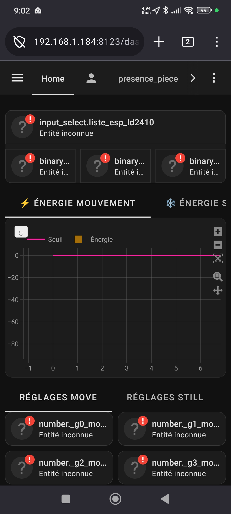
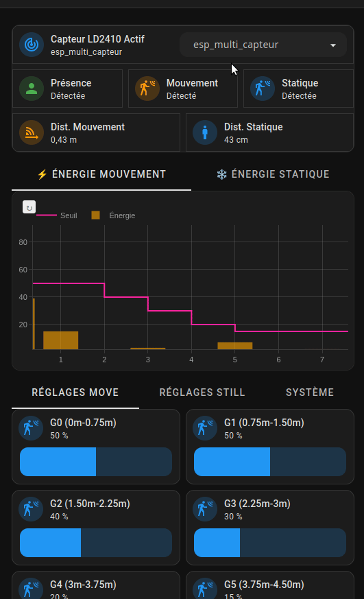

# 🎯 Configuration LD2410

Le module **HLK-LD2410** est un radar de présence mmWave (24GHz) capable de capter la simple respiration humaine (mouvements stationnaires).

## 🧠 Philosophie de configuration
Ce projet exploite le radar en mode ingénierie. Plutôt que de fournir une simple entité "Présent / Absent", ce dépôt expose les énergies cinétiques internes mesurées sur ses différentes "Gates" (portes).

### Qu'est-ce qu'une "Gate" ?
Le radar divise sa portée totale en **9 Portes (G0 à G8)** concentriques.
Grâce à notre paramètre dynamique, si vous réglez la "Résolution de distance" sur 0.75m, le dashboard calculera automatiquement :
- `G0` : 0m à 0.75m
- `G1` : 0.75m à 1.50m
- etc.

## 📁 Contenu du dossier
| Fichier | Rôle |
|---|---|
| `.ld2410.yaml` | Configuration ESPHome (firmware). À inclure dans le fichier principal de votre appareil ESP via `!include` |
| `ld2410_dashboard_card.yaml` | Code YAML de la carte Dashboard (à copier/coller en mode "Éditeur de code manuel") |
| `input_select.yaml` | Liste déroulante des ESP équipés d'un LD2410. À intégrer dans votre fichier `input_select.yaml` via `!include` (créez-le s'il n'existe pas) |
| `CONFIG_INPUT_SELECT.md` | Documentation complémentaire sur la configuration de l'input_select |
| `ld2410.jpg` | Capture d'écran du Dashboard |
| `ld2410.gif` | Démonstration animée du Dashboard en action |

## 🏷️ Convention de Nommage (CRITIQUE)
Le Dashboard dynamique repose entièrement sur la **construction d'entités par concaténation** du nom de l'ESP. C'est la clé de voûte de toute l'architecture.

Exemple : si votre `input_select` contient `esp_sdb`, le Dashboard génère automatiquement :
- `sensor.esp_sdb_g0_move_energy`
- `number.esp_sdb_g0_move_threshold`
- `sensor.esp_sdb_moving_distance`
- etc.

**Règles impératives :**
1. Le nom dans `input_select.yaml` **DOIT correspondre exactement** au `name:` de votre appareil ESPHome.
2. Pas de majuscules, pas d'espaces, pas de caractères spéciaux. Uniquement `[a-z0-9_]`.
3. Si vous renommez un ESP dans ESPHome, vous **devez aussi** le renommer dans le `input_select`.

> **⚠️ Si une seule lettre diffère**, le Dashboard affichera "Inconnu" sur toutes les entités de cet ESP.

## 📊 Le Dashboard Dynamique





Le fichier `ld2410_dashboard_card.yaml` inclut :
1. Un **Graphique Plotly** affichant en temps réel les seuils paramétrés VS l'énergie captée sur chaque porte.
2. Des colonnes séparées pour l'énergie de mouvement ("Move") et l'énergie stationnaire ("Still").
3. Une sélection dynamique : via un `input_select.liste_esp_ld2410`, vous pouvez utiliser le même graphique pour configurer tous les LD2410 de votre maison.

## ⚡ Substitutions : Mode Réglage vs Mode Production
La section `substitutions:` en tête du fichier `.ld2410.yaml` contrôle la réactivité du capteur :

```yaml
substitutions:
  # ---> MODE RÉGLAGE (Recommandé pour configurer via le Dashboard Plotly)
  # gate_throttle: 1s
  # energy_throttle: 1s
  #
  # ---> MODE PRODUCTION (Valeurs actuelles - Pour ne pas saturer Home Assistant)
  # gate_throttle: 60s
  # energy_throttle: 15s

  gate_throttle: 60s       # <-- Changez ici puis reflashez
  energy_throttle: 15s     # <-- Idem
```

> **Par défaut : Mode Production** (`60s` / `15s`). Pour calibrer vos seuils de détection, passez temporairement à `1s` / `1s`, reflashez, ajustez, puis restaurez les valeurs de Production.

## 🔧 Installation
1. **ESPHome** : Incluez `.ld2410.yaml` dans le fichier de votre appareil :
   ```yaml
   # Fichier : esp_sdb.yaml (exemple)
   packages:
     ld2410: !include .ld2410.yaml
   ```
2. **Home Assistant** : Intégrez le contenu de `input_select.yaml` dans votre fichier `input_select.yaml` existant. Si votre `configuration.yaml` ne contient pas encore `input_select: !include input_select.yaml`, ajoutez cette ligne et créez le fichier.
3. **Dashboard** : Copiez le contenu de `ld2410_dashboard_card.yaml` dans une carte en mode "Éditeur de code manuel".

## ⚙️ ESPHome - Configuration UART
Vous devez paramétrer correctement le composant UART :
```yaml
uart:
  tx_pin: GPIOxx
  rx_pin: GPIOxx
  baud_rate: 256000
```
