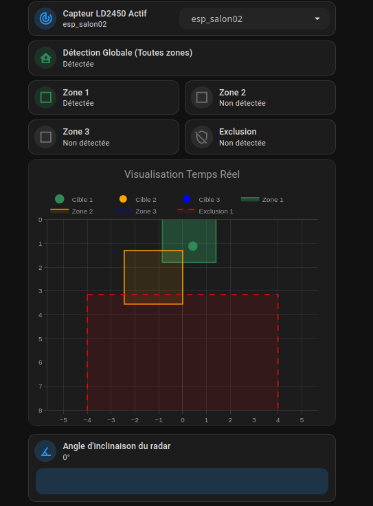

# 🎯 Configuration LD2450

Le module **HLK-LD2450** passe au niveau dimensionnel supérieur : le **2D Multi-Cibles**. Il identifie la position spatiale (sur un plan X, Y) d'un maximum de trois personnes.

## 🙏 Crédits & Source
Cette configuration est basée sur l'excellent travail de **[53l3cu5/ESP32_LD2450](https://github.com/53l3cu5/ESP32_LD2450)** (⭐ 112), qui a considérablement amélioré le firmware d'origine (Screek) :
- 1 à 10 zones de détection possibles
- 0 à 10 zones d'exclusion possibles
- Gestion de la fonctionnalité "Target must leave zone" en natif (pour 0 à 6 zones)
- Angle d'inclinaison configurable
- Portée étendue à 8m (départ possible à -0.5m)
- Positionnement par coordonnées X/Y + Largeur/Profondeur

> **⚠️ Ce dépôt n'est plus maintenu par son auteur.** Les demandes de support y sont ignorées. Notre version reprend et étend son travail de manière indépendante.

> **Outil de configuration** : Utilisez le générateur en ligne [53l3cu5.github.io](https://53l3cu5.github.io) pour préparer vos fichiers ESPHome de base avant de les adapter.
> **ATTENTION** : Le code de la carte Dashboard fourni dans ce dépôt (`radar_dashboard_card.yaml`) fonctionne *main dans la main* avec notre version modifiée du firmware `.ld2450.yaml` (qui est bâti pour **3 zones de détection et 1 zone d'exclusion**). Si vous décidez de générer vous-même un firmware différent via le site source avec un autre nombre de zones, la carte ne fonctionnera pas : vous devrez adapter le code YAML de Home Assistant pour qu'il corresponde à votre nouveau modèle.
> 
> **Note sur `zone.h`** : Le fichier C++ embarqué gérant les algorithmes spatiaux a été extrait directement depuis le générateur officiel du dépôt d'origine. Nous ne l'avons ni inventé ni altéré, il garantit la justesse des calculs mathématiques originels.

## ✨ Nos améliorations
En plus du projet source, cette version apporte :
- **Unités en Mètres natifs** : Les sliders et le graphique fonctionnent en mètres (au lieu des millimètres d'origine).
- **Dashboard Plotly dynamique** : Sélection multi-ESP via `input_select` pour gérer tous vos LD2450 depuis une seule carte.
- **Valeurs par défaut** : `initial_value` intégrées pour éviter les "Inconnu" au premier démarrage.
- **Gestion locale/virgule** : Protection contre le format décimal français (`,` → `.`) dans les calculs Javascript.
- **Angle d'inclinaison** : Prise en charge logicielle de l'angle physique du capteur. Le calcul trigonométrique s'ajuste dynamiquement.
- **Logique "Target Must Leave Zone"** : Permet de verrouiller l'état "Occupé" d'une zone tant que la cible est suivie par le radar, même si elle sort physiquement des limites de cette même zone (évite les coupures de lumière indésirables).
- **Gestion fine des Timeouts (120s)** : Les délais de maintien (Timeouts) acceptent désormais jusqu'à 2 minutes de rétention. De plus, sur le Dashboard, des contrôles par boutons de précision (+/-) garantissent un réglage fin à la seconde pour chaque zone (y compris l'exclusion).
- **Stabilité de la zone d'exclusion** : L'exclusion possède son propre filtre de timeout (`delayed_off`) pour éviter un vacillement "détecté / non-détecté" qui polluerait la présence globale lorsque la cible s'arrête net.

## 📁 Contenu du dossier
| Fichier | Rôle |
|---|---|
| `.ld2450.yaml` | Configuration ESPHome (firmware). À inclure dans le fichier principal de votre appareil ESP via `!include` |
| `esp-salon02.yaml` | Exemple de fichier appareil principal qui inclut le package via `packages: !include .ld2450.yaml` |
| `zone.h` | Librairie C++ embarquée pour le calcul des zones de détection |
| `radar_dashboard_card.yaml` | Code YAML de la carte Dashboard (à copier/coller en mode "Éditeur de code manuel") |
| `input_select.yaml` | Liste déroulante des ESP équipés d'un LD2450. À intégrer dans votre fichier `input_select.yaml` via `!include` (créez-le s'il n'existe pas) |

## 🏷️ Convention de Nommage (CRITIQUE)
Le Dashboard dynamique repose entièrement sur la **construction d'entités par concaténation**. Le nom déclaré de l'appareil agit comme une variable dans le code de la carte. C'est la clé de voûte logicielle de cette architecture.

Si vous voyez mes appareils préfixés par `esp_` (par exemple `esp_salon02`), sachez qu'il s'agit uniquement de ma propre convention de nommage personnelle pour retrouver mes appareils. Vous êtes libre de nommer votre capteur comme vous le souhaitez.

Voici comment la carte parvient à trouver vos entités. Prenons en exemple le capteur de mon salon dont le paramètre `name:` dans le fichier matériel ESPHome est déclaré en tant que : `esp_salon02`.
L'interface graphique va construire la commande finale en attachant dynamiquement **le domaine** + **le nom de l'ESP** + **le suffixe de la fonctionnalité** :

`number.` + `esp_salon02` + `_radar_zone1_x` = `number.esp_salon02_radar_zone1_x`

**Règles impératives :**
1. Les options que vous rajoutez dans `input_select.yaml` **DOIVENT correspondre exactement** à l'ID technique (slug) généré par l'appareil dans Home Assistant. 
2. **Pourquoi imposer des minuscules et `[a-z0-9_]` ?** Car Home Assistant applique nativement une "Slugification". Si vous créez l'appareil sous le nom "Radar Cuisine", HA va supprimer la majuscule, remplacer l'espace, et le transformer en l'ID technique `radar_cuisine`. Pour éviter que la lecture de variables Javascript du Dashboard ne se casse les dents sur une conversion hasardeuse de tiret ou d'espaces, il est impératif d'utiliser un format d'ID propre dès la racine dans ESPHome.
3. Si vous renommez un radar dans ESPHome, vous **devez aussi** impérativement mettre à jour ce nom dans les listes du `input_select`.

> **⚠️ Si une seule lettre diffère**, la concaténation échouera. Le Dashboard cherchera une entité qui n'existe pas et affichera alors du vide ou la mention "Inconnu" sur toutes les tuiles de la vue.

## 🗺️ Construction des Zones
L'interface de la carte `radar_dashboard_card.yaml` gère le traçage mathématique complexe d'aires de détection et zones d'exclusion.

Le Dashboard traduit ces paramètres pour son dessin cartographique interactif :
- `Limite Droite (X)` : Le calage sur l'axe horizontal.
- `Distance Initiale (Y)` : Le départ devant le capteur.
- `Expansion Gauche` : La zone couverte depuis X vers la gauche.
- `Profondeur` : Allongement vers le mur d'en face.
- `Angle d'inclinaison` : Compense la rotation du capteur s'il n'est pas posé parfaitement droit.

## 📊 Le Dashboard Dynamique

Le fichier YAML de carte incorpore un tracé Plotly avec support vectoriel.
* Les cibles bougent en temps réel sur un quadrillage `-4m à 4m` et `0 à 8m`.
* Les zones (Zone 1, Zone 2, Zone 3 et Zone d'Exclusion) s'affichent instantanément et changent d'opacité dès qu'elles sont altérées par une présence validée.

### Création des zones sur mesure


### Transfère de focus dynamique


## ⚡ Substitutions : Mode Réglage vs Mode Production
La section `substitutions:` en tête du fichier `.ld2450.yaml` contrôle la réactivité du capteur :

```yaml
substitutions:
  # ---> MODE RÉGLAGE (Tracé fluide et rapide des bonshommes sur le Dashboard)
  # uart_throttle_ms: "250"
  #
  # ---> MODE PRODUCTION (Valeurs actuelles - Pour soulager le Wi-Fi de l'ESP)
  # uart_throttle_ms: "1500"

  uart_throttle_ms: "1500"   # <-- Changez ici puis reflashez
```

> **Par défaut : Mode Production** (`1500ms`). Pour calibrer vos zones, passez temporairement à `"250"`, reflashez, ajustez, puis restaurez `"1500"`.

## 🔧 Installation
1. **ESPHome** : Incluez `.ld2450.yaml` dans le fichier de votre appareil :
   ```yaml
   # Fichier : esp_salon02.yaml (exemple)
   packages:
     ld2450: !include .ld2450.yaml
   ```
2. **Home Assistant** : Intégrez le contenu de `input_select.yaml` dans votre fichier `input_select.yaml` existant. Si votre `configuration.yaml` ne contient pas encore `input_select: !include input_select.yaml`, ajoutez cette ligne et créez le fichier.
3. **Dashboard** : Copiez le contenu de `radar_dashboard_card.yaml` dans une carte en mode "Éditeur de code manuel".

---

# 📝 Réglages des Zones LD2450 - Salon
Dernière mise à jour : 10 avril 2026

Voici les réglages optimaux relevés après configuration visuelle (valeurs en mètres). Ces valeurs correspondent aux `initial_value` du fichier `.ld2450.yaml`.

## 🌍 Paramètres Globaux
| Paramètre | Valeur |
| :--- | :--- |
| **Angle du Radar** | 0.0 ° |
| **Any Presence Timeout** | 0 s |

## 🟩 Zone 1
| Paramètre | Valeur (m) |
| :--- | :--- |
| **Centre (X)** | 1.35 m |
| **Départ (Y)** | -0.50 m |
| **Largeur** | 2.25 m |
| **Profondeur (Height)** | 2.30 m |
| **Timeout Zone** | 0 s |

## 🟧 Zone 2
| Paramètre | Valeur (m) |
| :--- | :--- |
| **Centre (X)** | -0.85 m |
| **Départ (Y)** | 1.30 m |
| **Largeur** | 2.25 m |
| **Profondeur (Height)** | 2.10 m |
| **Timeout Zone** | 0 s |

## 🟦 Zone 3 (Désactivée)
| Paramètre | Valeur (m) |
| :--- | :--- |
| **Centre (X)** | -4.00 m |
| **Départ (Y)** | -0.50 m |
| **Largeur** | 0.00 m |
| **Profondeur (Height)** | 0.00 m |
| **Timeout Zone** | 0 s |

## 🟥 Zone Exclusion 1
| Paramètre | Valeur (m) |
| :--- | :--- |
| **Centre (X)** | 4.00 m |
| **Départ (Y)** | 3.15 m |
| **Largeur** | 8.00 m |
| **Profondeur (Height)** | 4.90 m |

> [!TIP]
> Si vous souhaitez que ces valeurs deviennent les valeurs par défaut après un flash "propre" (erase memory), vous pouvez les reporter dans les champs `initial_value` du fichier `.ld2450.yaml`.
