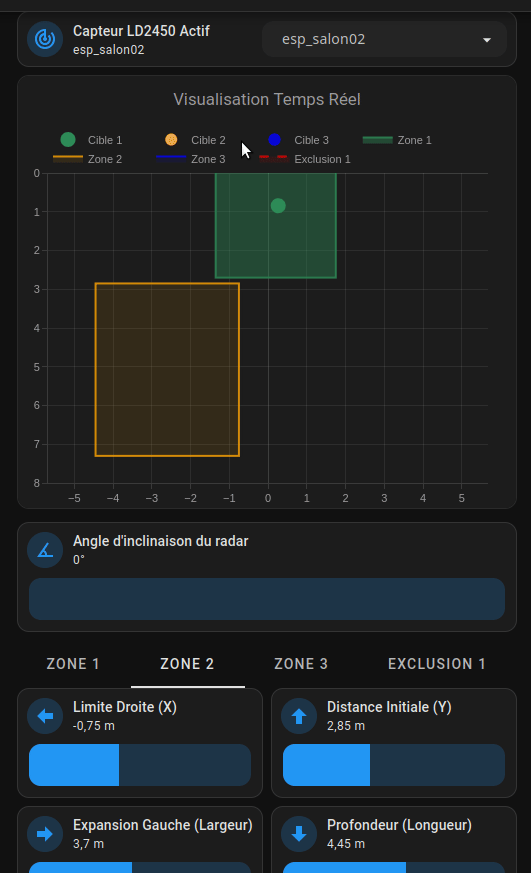

# 🎯 Configuration LD2450

Le module **HLK-LD2450** passe au niveau dimensionnel supérieur : le **2D Multi-Cibles**. Il identifie la position spatiale (sur un plan X, Y) d'un maximum de trois personnes.

## 🙏 Crédits & Source
Cette configuration est basée sur l'excellent travail de **[53l3cu5/ESP32_LD2450](https://github.com/53l3cu5/ESP32_LD2450)** (⭐ 112), qui a considérablement amélioré le firmware d'origine (Screek) :
- 6 zones de détection (au lieu de 3)
- 3 zones d'exclusion
- Angle d'inclinaison configurable
- Portée étendue à 8m (départ possible à -0.5m)
- Positionnement par coordonnées X/Y + Largeur/Profondeur

> **⚠️ Ce dépôt n'est plus maintenu par son auteur.** Les demandes de support y sont ignorées. Notre version reprend et étend son travail de manière indépendante.

> **Outil de configuration** : Utilisez le générateur en ligne [53l3cu5.github.io](https://53l3cu5.github.io) pour préparer vos fichiers ESPHome de base avant de les adapter.

## ✨ Nos améliorations
En plus du projet source, cette version apporte :
- **Unités en Mètres natifs** : Les sliders et le graphique fonctionnent en mètres (au lieu des millimètres d'origine).
- **Dashboard Plotly dynamique** : Sélection multi-ESP via `input_select` pour gérer tous vos LD2450 depuis une seule carte.
- **Valeurs par défaut** : `initial_value` intégrées pour éviter les "Inconnu" au premier démarrage.
- **Gestion locale/virgule** : Protection contre le format décimal français (`,` → `.`) dans les calculs Javascript.

## 📁 Contenu du dossier
| Fichier | Rôle |
|---|---|
| `.ld2450.yaml` | Configuration ESPHome (firmware). À inclure dans le fichier principal de votre appareil ESP via `!include` |
| `esp-salon02.yaml` | Exemple de fichier appareil principal qui inclut le package via `packages: !include .ld2450.yaml` |
| `zone.h` | Librairie C++ embarquée pour le calcul des zones de détection |
| `radar_dashboard_card.yaml` | Code YAML de la carte Dashboard (à copier/coller en mode "Éditeur de code manuel") |
| `input_select.yaml` | Liste déroulante des ESP équipés d'un LD2450. À intégrer dans votre fichier `input_select.yaml` via `!include` (créez-le s'il n'existe pas) |
| `REGLAGES_ZONE.md` | Documentation complémentaire sur le paramétrage des zones |
| `ld2450.gif` | Démonstration animée du Dashboard en action |

## 🏷️ Convention de Nommage (CRITIQUE)
Le Dashboard dynamique repose entièrement sur la **construction d'entités par concaténation** du nom de l'ESP. C'est la clé de voûte de toute l'architecture.

Exemple : si votre `input_select` contient `esp_salon02`, le Dashboard génère automatiquement :
- `sensor.esp_salon02_radar_target1_x`
- `number.esp_salon02_radar_zone1_x`
- `binary_sensor.esp_salon02_radar_zone1_presence`
- etc.

**Règles impératives :**
1. Le nom dans `input_select.yaml` **DOIT correspondre exactement** au `name:` de votre appareil ESPHome.
2. Pas de majuscules, pas d'espaces, pas de caractères spéciaux. Uniquement `[a-z0-9_]`.
3. Si vous renommez un ESP dans ESPHome, vous **devez aussi** le renommer dans le `input_select`.

> **⚠️ Si une seule lettre diffère**, le Dashboard affichera "Inconnu" sur toutes les entités de cet ESP.

## 🗺️ Construction des Zones
L'interface de la carte `radar_dashboard_card.yaml` gère le traçage mathématique complexe d'aires de détection et zones d'exclusion.

Le Dashboard traduit ces paramètres pour son dessin cartographique interactif :
- `Limite Droite (X)` : Le calage sur l'axe horizontal.
- `Distance Initiale (Y)` : Le départ devant le capteur.
- `Expansion Gauche` : La zone couverte depuis X vers la gauche.
- `Profondeur` : Allongement vers le mur d'en face.

## 📊 Le Dashboard Dynamique



Le fichier YAML de carte incorpore un tracé Plotly avec support vectoriel.
* Les cibles bougent en temps réel sur un quadrillage `-4m à 4m` et `0 à 8m`.
* Les zones (Zone 1, Zone 2, Zone 3 et Zone d'Exclusion) s'affichent instantanément et changent d'opacité dès qu'elles sont altérées par une présence validée.

## ⚡ Substitutions : Mode Réglage vs Mode Production
La section `substitutions:` en tête du fichier `.ld2450.yaml` contrôle la réactivité du capteur :

```yaml
substitutions:
  # ---> MODE RÉGLAGE (Tracé fluide et rapide des bonshommes sur le Dashboard)
  # uart_throttle_ms: "250"
  #
  # ---> MODE PRODUCTION (Valeurs actuelles - Pour soulager le Wi-Fi de l'ESP)
  # uart_throttle_ms: "1500"

  uart_throttle_ms: "1500"   # <-- Changez ici puis reflashez
```

> **Par défaut : Mode Production** (`1500ms`). Pour calibrer vos zones, passez temporairement à `"250"`, reflashez, ajustez, puis restaurez `"1500"`.

## 🔧 Installation
1. **ESPHome** : Incluez `.ld2450.yaml` dans le fichier de votre appareil :
   ```yaml
   # Fichier : esp_salon02.yaml (exemple)
   packages:
     ld2450: !include .ld2450.yaml
   ```
2. **Home Assistant** : Intégrez le contenu de `input_select.yaml` dans votre fichier `input_select.yaml` existant. Si votre `configuration.yaml` ne contient pas encore `input_select: !include input_select.yaml`, ajoutez cette ligne et créez le fichier.
3. **Dashboard** : Copiez le contenu de `radar_dashboard_card.yaml` dans une carte en mode "Éditeur de code manuel".

## ⚙️ Calibration recommandée
Les réglages d'usine sont insérés de manière préventive pour éviter le plantage visuel de rendu au flash initial :
```yaml
# Valeurs par défaut (initial_value dans le firmware)
Zone1_X: 2.38m
Zone1_Width: 2.34m
Zone1_Y: -0.50m
Zone1_Height: 2.63m
```
